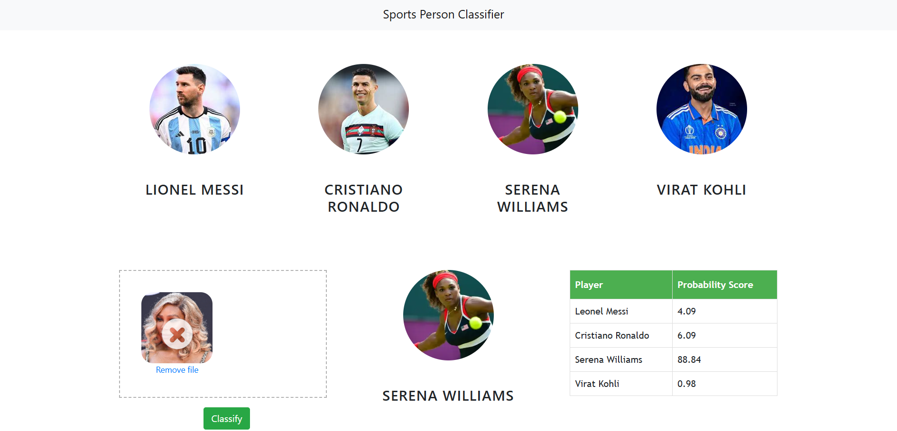

# Sports Celebrity Classification



## Project overview

A small data-science / machine-learning project that classifies sports personalities. This project restricts classification to **four** people:

* Cristiano Ronaldo
* Serena Williams
* Virat Kohli
* Lionel Messi

## Folder structure

```
UI/                       # Frontend website code (HTML/CSS/JS)
server/                   # Python Flask server and helper utilities
model/                    # Jupyter notebook(s) used to build and export the ML model
images_dataset/           # Raw images used for training the model
pictures/                 # Screenshots and other images (UI.png included)
artifacts/                # (generated) saved_model.pkl, class_dictionary.json
README.md                 # This file
```

> Note: In this repo your screenshot `UI.png` is stored at:
> `D:\Cursor Document\Sports-celebrity-Classificatio\pictures\UI.png` — consider moving it into the project `pictures/` folder and using a relative path (`pictures/UI.png`) for portability.

## Technologies used

* **Python**
* **NumPy** and **OpenCV** — data cleaning and basic image ops
* **Matplotlib** & **Seaborn** — visualization
* **scikit-learn (sklearn)** — model training / evaluation (SVC used)
* **Jupyter Notebook** / Cursor — model development environment
* **Flask** — lightweight HTTP server to serve predictions
* **HTML / CSS / JavaScript** — frontend UI
* **Fatkun chrome tool** — download the dataset(images)

---
